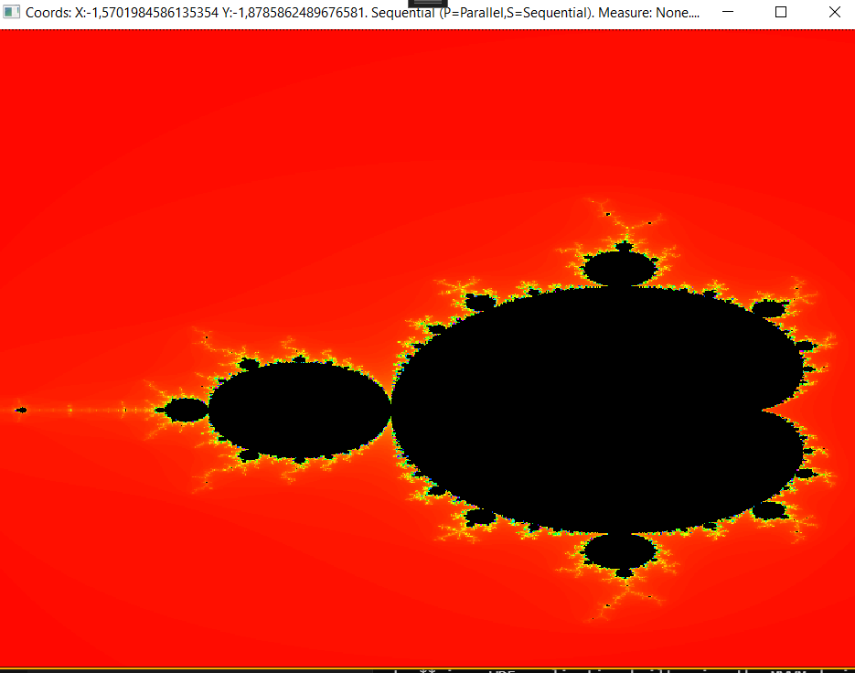
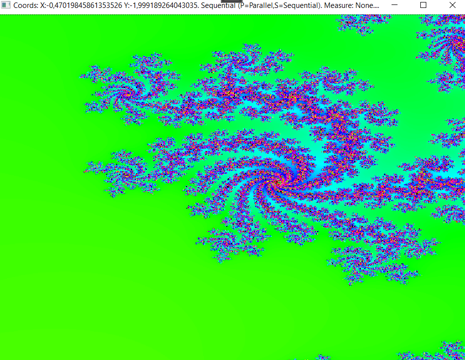

<!-- PROJECT SHIELDS -->
[![Contributors][contributors-shield]][contributors-url]
[![Forks][forks-shield]][forks-url]
[![Stargazers][stars-shield]][stars-url]
[![Issues][issues-shield]][issues-url]
[![LinkedIn][linkedin-shield]][linkedin-url]

<!-- PROJECT LOGO -->
 

<!--   -->

<h3 align="center">ParallelMandelbrot</h3>

  

    Generating mandelbrot fractals with GPU parallel computing.
     
    <a href="https://github.com/mavosy/ParallelMandelbrot"><strong>Explore the docs »</strong></a>
     
     
    <a href="https://github.com/mavosy/ParallelMandelbrot/issues/new?labels=bug&template=bug-report---.md">Report Bug</a>
    ·
    <a href="https://github.com/mavosy/ParallelMandelbrot/issues/new?labels=enhancement&template=feature-request---.md">Request Feature</a>
  

<!-- TABLE OF CONTENTS -->

  
Table of Contents

  <ol>
    <li>
      <a href="#about-the-project">About The Project</a>
      <ul>
        <li><a href="#built-with">Built With</a></li>
      </ul>
    </li>
    <li>
      <a href="#getting-started">Getting Started</a>
      <ul>
        <li><a href="#prerequisites">Prerequisites</a></li>
        <li><a href="#installation">Installation</a></li>
      </ul>
    </li>
    <li><a href="#usage">Usage</a></li>
    <li><a href="#roadmap">Roadmap</a></li>
    <li><a href="#license">License</a></li>
    <li><a href="#contact">Contact</a></li>
  </ol>

<!-- ABOUT THE PROJECT -->
## About The Project

**ParallelMandelbrot** is a school project focused on generating Mandelbrot fractal images using parallel computing techniques. The project explores GPU acceleration by leveraging the Amplifier.NET library to parallelize the Mandelbrot fractal calculations, allowing for improved performance compared to traditional CPU-bound methods. While the fractal generation algorithm itself was provided as part of the course, the parallelization of the calculations using the GPU was done collaboratively with a classmate.

This project serves as an educational exercise in exploring parallel computing and GPU-based optimizations for computationally expensive tasks in C#/.NET.

 

  
  

(<a href="#readme-top">back to top</a>)

### Built With

* [![C#][csharp-shield]][csharp-url]

(<a href="#readme-top">back to top</a>)

<!-- GETTING STARTED -->
## Getting Started

Follow these steps to get a local copy up and running.

### Prerequisites

- .NET 7.0 SDK or later
- Visual Studio 2022 or another IDE with WPF support

### Installation

1. Clone the repo.

2. Open the solution in Visual Studio and build the project.

(<a href="#readme-top">back to top</a>)

<!-- USAGE EXAMPLES -->
## Usage

1. Launch the console application.
2. Choose sequential or parallel execution.
3. Either click on the screen where you want to zoom, 
   or zoom towards a predestined coordinate using the instructions.
4. Expand your mind!

(<a href="#readme-top">back to top</a>)

<!-- ROADMAP -->
## Roadmap

Optimization and Performance:
- [ ] Fine-tune the parallelization to maximize GPU usage and minimize idle time.
- [ ] Benchmark and present performance differences between GPU and CPU computations for various dataset sizes.

Features:
- [ ] Add real-time zoom functionality to explore fractal regions interactively, steering through the fractals with the arrows.
- [ ] Implement color schemes to enhance fractal visualization.
- [ ] Add support for saving fractal images at different resolutions.

Visualization and UI Enhancements:
- [ ] Improve the graphical interface with better control over fractal parameters (e.g., zoom levels, iteration limits).
- [ ] Display real-time performance metrics (e.g., frame rates, GPU utilization) while generating the fractal.

See the [open issues](https://github.com/mavosy/ParallelMandelbrot/issues) for a full list of proposed features (and known issues).

(<a href="#readme-top">back to top</a>)

### Top contributors:

<!-- LICENSE -->
## License

Distributed under the MIT License. See `LICENSE.txt` for more information.

(<a href="#readme-top">back to top</a>)

<!-- CONTACT -->
## Contact

mavosy - maltesydow@gmail.com

Project Link: [https://github.com/mavosy/ParallelMandelbrot](https://github.com/mavosy/ParallelMandelbrot)

(<a href="#readme-top">back to top</a>)

<!-- MARKDOWN LINKS & IMAGES -->
<!-- https://www.markdownguide.org/basic-syntax/#reference-style-links -->
[contributors-shield]: https://img.shields.io/github/contributors/mavosy/ParallelMandelbrot.svg?style=for-the-badge
[contributors-url]: https://github.com/mavosy/ParallelMandelbrot/graphs/contributors
[forks-shield]: https://img.shields.io/github/forks/mavosy/ParallelMandelbrot.svg?style=for-the-badge
[forks-url]: https://github.com/mavosy/ParallelMandelbrot/network/members
[stars-shield]: https://img.shields.io/github/stars/mavosy/ParallelMandelbrot.svg?style=for-the-badge
[stars-url]: https://github.com/mavosy/ParallelMandelbrot/stargazers
[issues-shield]: https://img.shields.io/github/issues/mavosy/ParallelMandelbrot.svg?style=for-the-badge
[issues-url]: https://github.com/mavosy/ParallelMandelbrot/issues
[license-shield]: https://img.shields.io/github/license/mavosy/ParallelMandelbrot.svg?style=for-the-badge
[license-url]: https://github.com/mavosy/ParallelMandelbrot/blob/master/LICENSE.txt
[linkedin-shield]: https://img.shields.io/badge/-LinkedIn-black.svg?style=for-the-badge&logo=linkedin&colorB=555
[linkedin-url]: https://linkedin.com/in/malte-von-sydow
[csharp-shield]: https://custom-icon-badges.demolab.com/badge/C%23-%23239120.svg?logo=cshrp&logoColor=white
[csharp-url]: https://learn.microsoft.com/en-us/dotnet/csharp/
